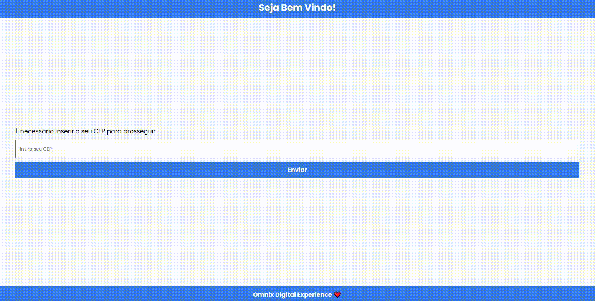
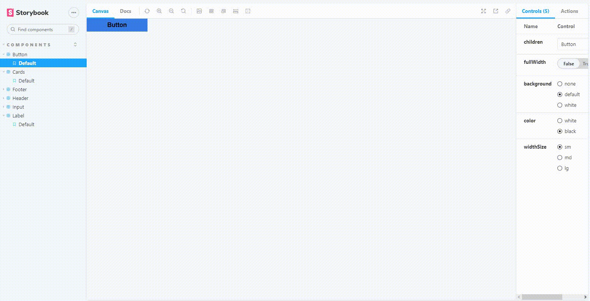

<h1 align="center">📔 Omnix Digital Experience (Teste)</h1>



🗔 Confira a aplicação: https://omnix-test.vercel.app

## :page_facing_up: Explicação do Desafio

Imagine que você foi contratado para desenvolver parte de uma landing page com foco na venda de planos de internet. O sistema de checkout já foi desenvolvido, então você deve desenvolver a página Home e de Ofertas. Ao acessar o site, o cliente se depara com uma mensagem de boas vindas e um formulário requisitando seu cep para prosseguir. Você deve utilizar a API da ViaCep para captar os dados do endereço. Ao avançar, é mostrada uma tela com uma mensagem contendo endereço informado, as ofertas dispovíveis para o cliente e um botão fixo no canto inferior direito da tela com a mensagem “Ops, errei meu cep!”, que, ao ser clicado, volta para a página anterior.

🎲 **O que será avaliado**

- HTML
- CSS (uso de Flex Layout)
- JavaScript
- Lógica de programação
- Organização de código

⚠️ **Diferenciais**

- Utilizar HTML semântico [✔️]
- Utilizar Typescript [✔️]
- Utilizar a Next.js [✔️]
- Utilizar a Context API [✔️]
- Utilizar a Storybook [✔️]
- Utilizar a Teste Unitários [✔️]

## 📁 Páginas

O site tem no total 2 páginas, sendo elas:

- **Home:** A página inicial do site que precisa que o campo de texto seja preenchido com um CEP válido.
- **Offers:** A página apresenta os dados consumidos pela API [Via CEP](https://viacep.com.br), além de alguns cards com planos de Internet.

## 🎨 Story

A documentação dos componentes que fiz utilizando a tecnologia [Storybook](https://storybook.js.org).


## 🚀 Tecnologias

- [Next.js](https://nextjs.org)
- [React Hooks](https://pt-br.reactjs.org/docs/hooks-intro.html)
- [AuthContext](https://blog.rocketseat.com.br/autenticacao-no-react-native-reactjs-com-context-api-hooks/)
- [Styled Components](https://styled-components.com)
- [Storybook](https://storybook.js.org)
- [Jest](https://jestjs.io/pt-BR/docs/getting-started)
- [Testing Library](https://testing-library.com)

## 🛰️ API🎨
- [Via CEP](https://viacep.com.br)


## :closed_book: Como usar?

Antes de iniciar, você precisa ter [Git](https://git-scm.com) e [Node](https://nodejs.org/en/) instalados.

```bash
# Clone this project
$ git clone https://testing-library.com

# Access
$ cd teste

# Install dependencies
$ yarn or npm

# Run the project
$ yarn start or npm start

# The server will initialize in the <http://localhost:3000>
```

## 🤝 Colaboradores

Agradecemos às seguintes pessoas que contribuíram para este projeto:

<table>
  <tr>
    <td align="center">
      <a href="#">
        <br>
        <sub>
          <b>Kayke Fujinaka</b>
        </sub>
      </a>
    </td>
  </tr>
</table>

## 📝 Licença

Este projeto está sob licença. Consulte o arquivo [LICENSE](LICENSE.md) para obter mais detalhes.

&#xa0;

<a href="#top">Volte para o topo</a>
